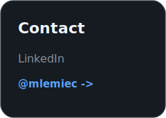
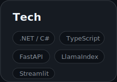
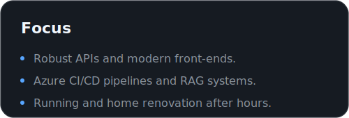
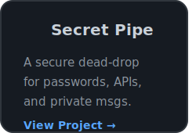
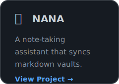

  <table>
    <tr>
      <td colspan="2"></td>
      <td></td>
    </tr>
    <tr>
      <td rowspan="2"></td>
      <td colspan="2"></td>
    </tr>
    <tr>
      <td></td>
      <td></td>
    </tr>
    <tr>
      <td colspan="3">
        
      </td>
    </tr>
  </table>

